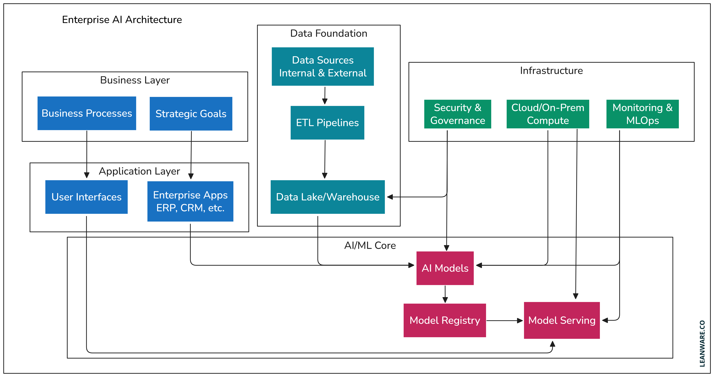

1. ai 개발 환경
    1). 
        +4
        AI 개발 환경 구축은 파이썬 기반으로 아나콘다/미니콘다를 설치해 가상환경(conda)을 만들고, VSCode 같은 IDE를 사용해 TensorFlow, PyTorch 등 필수 라이브러리를 설치하며, 필요시 GPU 설정과 Docker를 활용해 효율적인 개발 및 협업 환경을 만드는 과정입니다. 초기에는 Google Colab 같은 클라우드 환경으로 시작하는 것도 좋은 방법입니다. 
        1. 기본 환경 설정
        파이썬 & 아나콘다/미니콘다: AI 개발의 핵심 언어인 파이썬을 설치하고, 패키지 관리를 쉽게 해주는 아나콘다(Anaconda)나 미니콘다(Miniconda)를 설치합니다.
        가상환경 생성: 프로젝트별로 필요한 라이브러리 버전을 격리하기 위해 conda create -n [환경이름] python=3.x 명령어로 가상환경을 만듭니다.
        IDE 및 편집기: 코딩을 편리하게 도와주는 VSCode, Jupyter Notebook 등을 설치하고 활용합니다. 
        이 영상은 AI 개발자를 위한 Docker 환경 설정 및 필수 라이브러리 설치 방법을 보여줍니다:
        관련 동영상 썸네일
        58s

        일하는 ai
        YouTube • 2024. 12. 1.
        2. 필수 라이브러리 설치
        핵심 프레임워크: pip install tensorflow 또는 pip install torch torchvision 등으로 딥러닝 프레임워크를 설치합니다.
        데이터 처리: NumPy, Pandas, Matplotlib, Scikit-learn 등 데이터 분석 및 머신러닝에 필요한 라이브러리를 설치합니다. 
        3. GPU 환경 설정 (선택 사항)
        필요성: 모델 학습 속도를 높이기 위해 NVIDIA GPU 및 CUDA Toolkit, cuDNN을 설치하고 관련 라이브러리 버전을 맞춰야 합니다. 
        4. 효율적인 개발 및 협업을 위한 도구 (선택 사항)
        Docker: 컨테이너 기술로 환경 설정의 번거로움을 없애고, 협업 시 동일한 개발 환경을 쉽게 구축하고 공유할 수 있습니다.
        GitHub: 소스 코드 버전 관리를 위해 Git을 설정하고 GitHub를 활용합니다.
        Kubeflow: 대규모 MLOps 환경 구축 시 고려할 수 있는 플랫폼입니다. 
        5. 시작하기 좋은 방법
        Google Colab: 별도 설치 없이 웹 브라우저에서 바로 GPU를 사용하며 AI 실습을 시작할 수 있어 초보자에게 가장 추천됩니다. 
        
    2). AI 개발 환경이란?

    AI 개발 환경이란?
    AI 개발 환경은 인공지능 모델을 설계·학습·검증·배포·운영하기까지의 전 과정을 효율적으로 수행하도록 구성된 도구, 소프트웨어, 하드웨어, 인프라의 집합이다. 단순한 코딩 환경을 넘어, 데이터 파이프라인과 실험 관리, 대규모 연산, 서비스 운영까지 포함한다.
    
    1) 핵심 구성 요소
    ① 개발 도구
    언어: Python(사실상 표준), R, C++
    IDE/노트북: VS Code, Jupyter Notebook
    버전 관리: Git
    ② AI 프레임워크·라이브러리
    딥러닝: TensorFlow, PyTorch
    머신러닝: scikit-learn
    데이터 처리: NumPy, Pandas
    ③ 데이터 환경
    저장소: 로컬 스토리지, NAS, 데이터 레이크
    전처리·파이프라인: ETL, 피처 엔지니어링
    라벨링 도구: 수동/반자동 라벨링

    ④ 연산 자원
    CPU / GPU / TPU
    클러스터·병렬 처리: 분산 학습, 멀티 GPU
    ⑤ 실험·모델 관리
    실험 추적: 하이퍼파라미터, 메트릭
    모델 레지스트리: 버전, 재현성, 롤백

    ⑥ 배포·운영(MLOps)
    컨테이너: Docker
    오케스트레이션: Kubernetes
    모니터링: 성능·드리프트 감지
    CI/CD: 자동 학습·배포 파이프라인

    2) 개발 환경 유형
    구분	특징	적합한 상황
    로컬 환경	개인 PC 기반, 빠른 실험	학습·프로토타입
    온프레미스	자체 서버·보안 통제	민감 데이터
    클라우드	탄력적 확장, 관리 용이	대규모 학습·서비스
    하이브리드	로컬+클라우드	비용·보안 균형
    3) 왜 중요한가?

    생산성: 반복 실험 자동화, 협업 효율

    확장성: 데이터·모델 규모 증가 대응

    재현성: 실험 결과 추적·검증

    운영 안정성: 배포 후 성능 유지

    4) 한 문장 요약

    AI 개발 환경은 데이터부터 모델 운영까지 전 주기를 안정적·확장 가능하게 만드는 통합 작업 공간이다.

    필요 시 **개발 목적(연구/서비스)**이나 **규모(개인/팀/기업)**에 맞춘 구체적인 환경 구성 예시를 제시할 수 있다.

2. hpc - 1
 